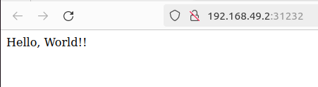

# Lab Report  
## Angyal János - S50LXk  

Feltöltöttem a kódot github-ra a kapott Dockerfile-al. 
Létrehoztam egy Helm chartot a `helm create my-app` paranccsal és megírtam a template fájlokat.
Majd létrehoztam a github workflow fájlokat. Végezetül bekonfiguráltam az ArgoCD-ben az alkalmazást a kért módon.

Majd kivácsiságból csináltam még egy pipelinet ami elkészíti a beadható dokumentációt a markdown fájlokból.  

  
  
  
  

